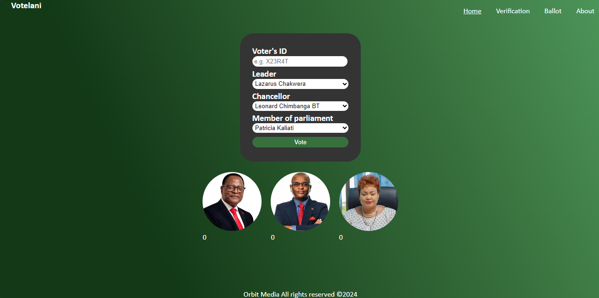

# Votelani 1

This web application is a platform where a set of candidates running for elections in a political scope can be set on a poll for citizens to cast votes. 2 to multiple presidential, chancellor and members of parliament candidates respectively may be set on a poll to see which one candidate from the three domains has been chosen as the peoples champion.

The users are greeted with a landing page that puts them right in the center of casting a vote without having to navigate elsewhere. For every vote that is casted, that particular voter will not be allowed to vote again nor retain their vote, be sure of your decisions. The voting period will be limited to a single day when the voting day is open.

For testing purposes, it will be open till system completion. Once a voting session is complete, voters should be shown the results on the landing page. Progress of the voter's choices so far should be seen in real time close to the candidates chosen prior a casted vote.

## Main Functions

- 🗳️ Casting a vote
- 📊 Viewing live vote count for candidates
- 🥇 Show final results

## Other functions

- Concurrent access to platform
- Register candidates
- Post notices

## The main Dashboard

This is the full UI on a generic display, UI may vary depending on screen size and resolution

This is the Entity relationship diagram with shows the model of the database structure in use

